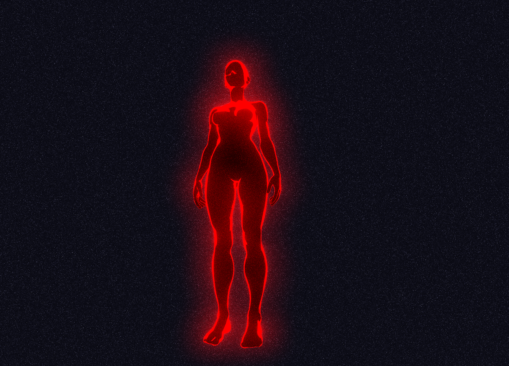

## Hi there 👋 I'm Paweł
I'm a software engineer with ~5 years of experience. My career is oribiting mainly around frontend stuff, occasionally backend. Recently discovered my passion for creating 3d experiences using THREE.js and WebGPU.

| R3F - Singularity [Live](https://pawelataman.github.io/r3f-singularity/) - [Code](https://github.com/pawelataman/r3f-singularity)
| ------------------------------------------------------------------------------ |
|  |
